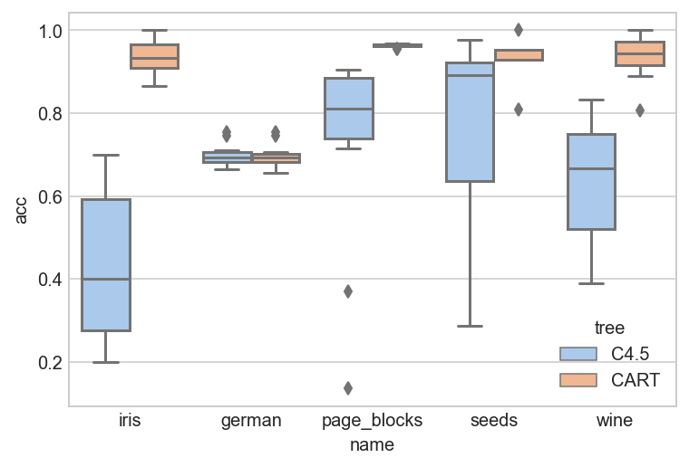
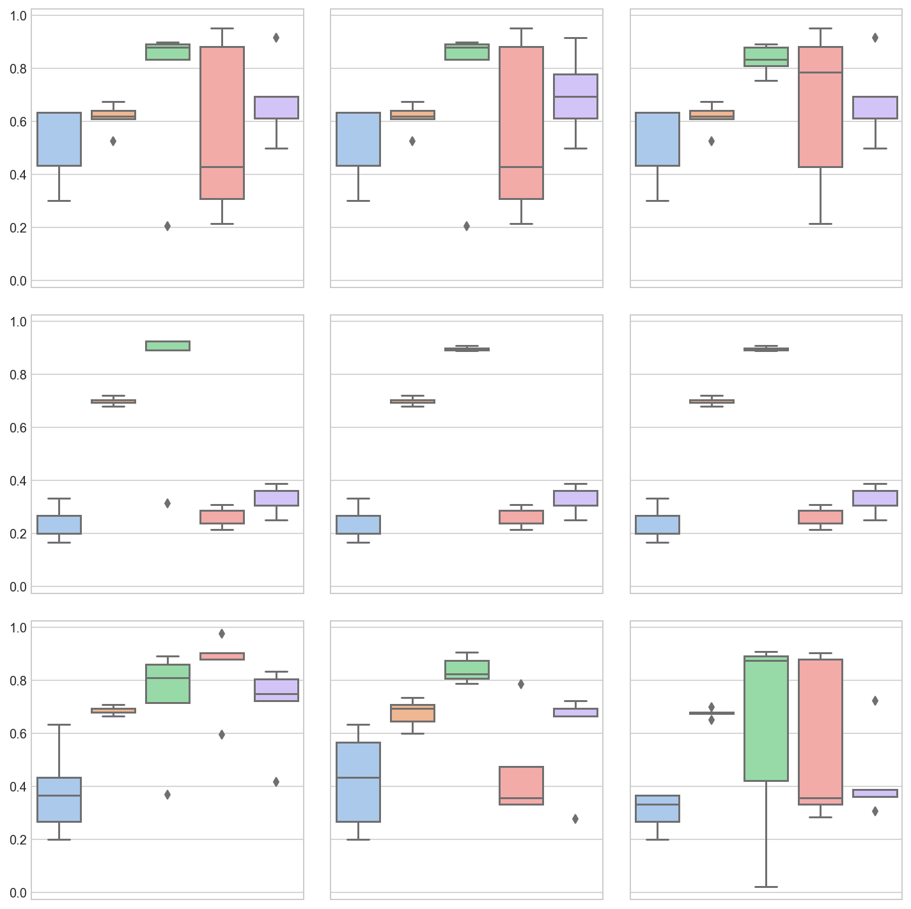

# Decision Tree

An implementation of the simplified C4.5 algorithm.

Use `milksets` package for loading UCI datasets.

## Installation

```
git clone https://github.com/usualwitch/decision-tree.git
cd decision-tree
pip install .
```

## Usage

```python
from milksets import seeds
from dt import DecisionTree
X, y = seeds.load()
tr = DecisionTree(X, y, prune_method='Comp', loss='entropy')
tr.postprune()
```

## Algorithms

For details of the tree building and pruning algorithms, see [this post](https://blog.usualwitch.now.sh/posts/decision-tree/).

The general cost-complexity pruning method we employ is to first build a tree without pruning, and calculate alphas from this tree. Then we use cross validation to select a best alpha to prune the tree.

## Experiments

### Comparison of C4.5 and CART

Both algorithms use cost-complexity pruning strategy. We applied a 5-fold stratified cross-validation to find the best alpha. The results are listed in the following table.

<table>
 <tr>
  <td>name&nbsp;</td>
  <td>tree&nbsp;</td>
  <td>alpha&nbsp;</td>
  <td>acc&nbsp;</td>
 </tr>
 <tr>
  <td rowspan="3">german&nbsp;</td>
  <td>C4.5&nbsp;</td>
  <td>0.0&nbsp;</td>
  <td>0.700&nbsp;</td>
 </tr>
 <tr>
  <td rowspan="2">CART&nbsp;</td>
  <td>0.0&nbsp;</td>
  <td>0.675&nbsp;</td>
 </tr>
 <tr>
  <td>0.5&nbsp;</td>
  <td>0.704&nbsp;</td>
 </tr>
 <tr>
  <td rowspan="2">iris&nbsp;</td>
  <td>C4.5&nbsp;</td>
  <td>0.0&nbsp;</td>
  <td>0.430&nbsp;</td>
 </tr>
 <tr>
  <td>CART&nbsp;</td>
  <td>0.0&nbsp;</td>
  <td>0.933&nbsp;</td>
 </tr>
 <tr>
  <td rowspan="2">page_blocks&nbsp;</td>
  <td>C4.5&nbsp;</td>
  <td>0.0&nbsp;</td>
  <td>0.721&nbsp;</td>
 </tr>
 <tr>
  <td>CART&nbsp;</td>
  <td>0.0&nbsp;</td>
  <td>0.963&nbsp;</td>
 </tr>
  <tr>
  <td rowspan="2">seeds&nbsp;</td>
  <td>C4.5&nbsp;</td>
  <td>0.0&nbsp;</td>
  <td>0.774&nbsp;</td>
 </tr>
 <tr>
  <td>CART&nbsp;</td>
  <td>0.0&nbsp;</td>
  <td>0.936&nbsp;</td>
 </tr>
  <tr>
  <td rowspan="2">wine&nbsp;</td>
  <td>C4.5&nbsp;</td>
  <td>0.0&nbsp;</td>
  <td>0.636&nbsp;</td>
 </tr>
 <tr>
  <td>CART&nbsp;</td>
  <td>0.0&nbsp;</td>
  <td>0.936&nbsp;</td>
 </tr>
</table>



In general CART works better than C4.5. This simplified version of C4.5’s test error is quite unstable with regard to the random choice of train and test sets, which should be resolved to make it applicable.

### Different prune methods and loss functions

The experiment result is displayed in the picture below.

Prune methods correspond to the three rows, including

+ Reduce error pruning (error can be substituted by another loss function)
+ Pessimistic pruning
+ Cost-complexity pruning

Loss functions correspond to the three columns, including

+ empirical entropy
+ gini impurity
+ 0-1 loss



From the figure,

+ Reduce error pruning and pessimistic pruning is insensitive to loss functions.
+ In C4.5, where we use entropy to build the tree, cost-complexity pruning works pretty bad with 0-1 loss. Using entropy as loss in postpruning is a more coherent choice.

The average accuracy of the prune methods and losses are listed in the table below.

<table>
 <tr>
  <td>prune method&nbsp;</td>
  <td>loss&nbsp;</td>
  <td>acc&nbsp;</td>
 </tr>
 <tr>
  <td rowspan="3">cost-complexity&nbsp;</td>
  <td>0-1&nbsp;</td>
  <td>0.517&nbsp;</td>
 </tr>
 <tr>
  <td>entropy&nbsp;</td>
  <td>0.671&nbsp;</td>
 </tr>
 <tr>
  <td>gini&nbsp;</td>
  <td>0.601&nbsp;</td>
 </tr>
 <tr>
  <td rowspan="3">pessimistic&nbsp;</td>
  <td>0-1&nbsp;</td>
  <td>0.489&nbsp;</td>
 </tr>
 <tr>
  <td>entropy&nbsp;</td>
  <td>0.469&nbsp;</td>
 </tr>
 <tr>
  <td>gini&nbsp;</td>
  <td>0.489&nbsp;</td>
 </tr>
 <tr>
  <td rowspan="3">reduce error&nbsp;</td>
  <td>0-1&nbsp;</td>
  <td>0.654&nbsp;</td>
 </tr>
  <tr>
  <td>entropy&nbsp;</td>
  <td>0.617&nbsp;</td>
 </tr>
 <tr>
  <td>gini&nbsp;</td>
  <td>0.620&nbsp;</td>
 </tr>
</table>
The best choice among these is the cost-complexity pruning with entropy loss.

## Reference

1. J. Ross Quinlan. C4.5: programs for machine learning (1993).
   https://dl.acm.org/doi/book/10.5555/152181

2. Mingers, J. An Empirical Comparison of Pruning Methods for Decision Tree Induction. Machine Learning, 4, 227–243 (1989).
   https://doi.org/10.1023/A:1022604100933

3. Hastie, T.; Tibshirani, R. & Friedman, J. (2001), The Elements of Statistical Learning, Springer New York Inc. , New York, NY, USA (2001).

## License

[MIT](https://choosealicense.com/licenses/mit/)

